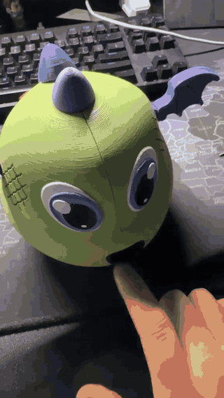
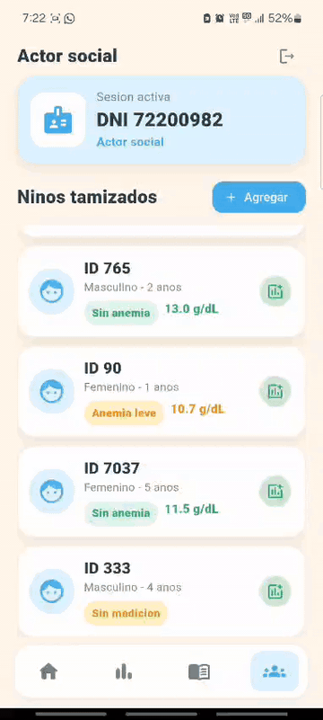

# Avances del prototipo

## Funcionamiento del dispositivo

  

## Funcionamiento de la aplicación

  

## Avances alcanzados

- Integración del prototipo.
- Comunicación con la aplicación móvil.
- Visualización de los resultados.
- Registro de las mediciones.

