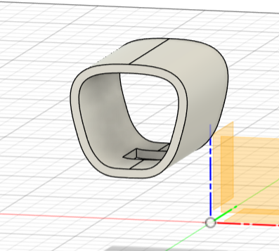
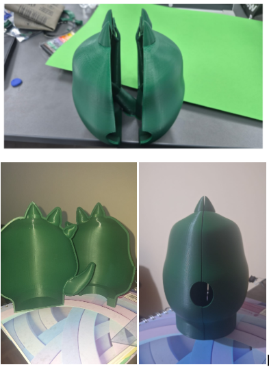
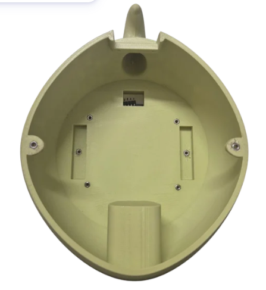
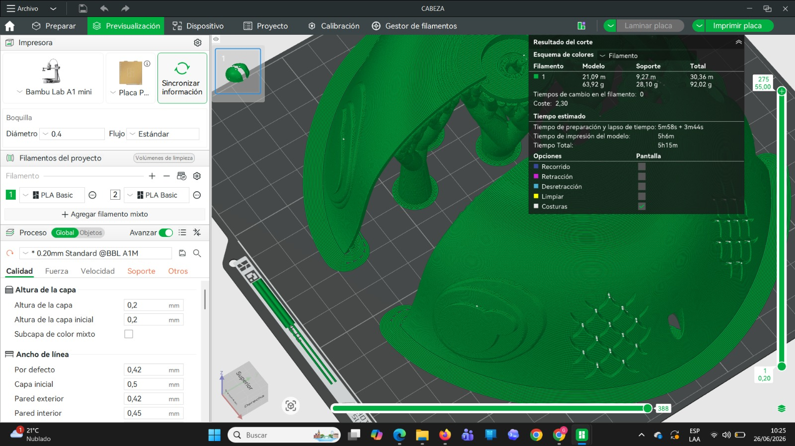
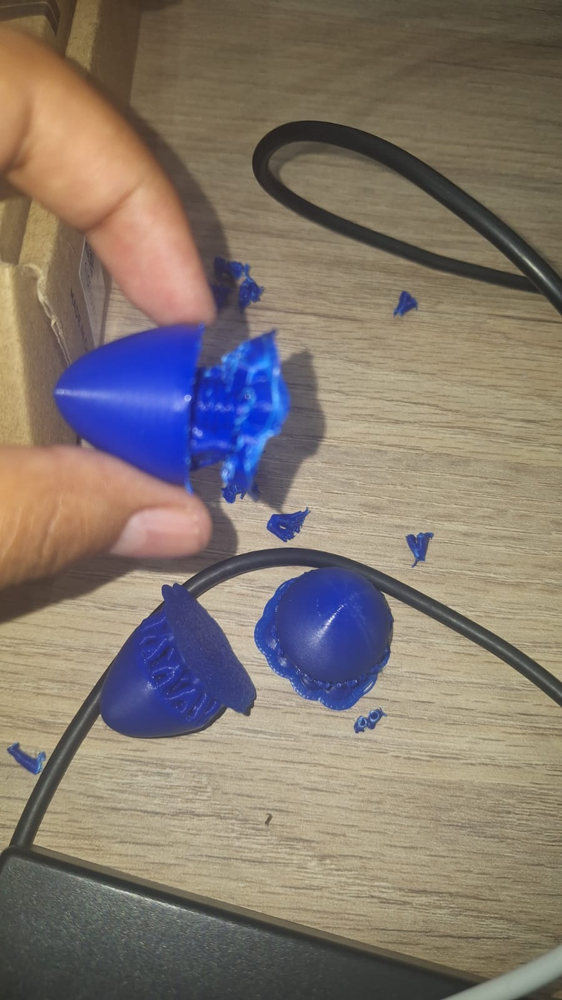
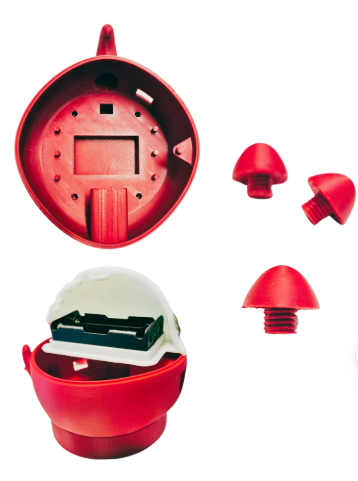
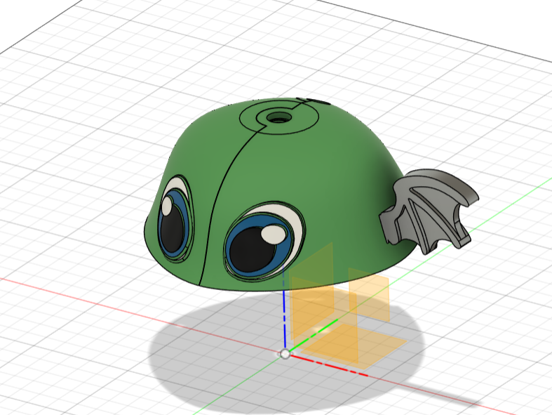
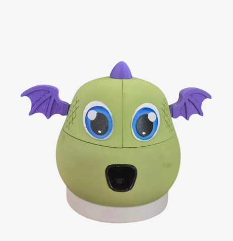

# Diseño y modelado 3D

La carcasa de HemoKit fue desarrollada mediante un proceso iterativo de diseño, impresión y evaluación. El modelado buscó integrar los componentes del prototipo, facilitar la colocación del dedo y crear una apariencia amigable para niñas y niños.

## Diseño de la zona de sensado

Se trabajó la geometría de la entrada para facilitar la interacción con el dispositivo y la ubicación de la zona de medición.

  

## Evolución de la carcasa

Se fabricaron distintas versiones para evaluar dimensiones, uniones, acabado y compatibilidad entre las piezas.

  

## Diseño interno

El interior fue ajustado progresivamente para organizar los componentes y mejorar el ensamblaje general.

  

## Preparación para impresión

Antes de fabricar las piezas se revisaron su orientación, soportes y distribución en la plataforma de impresión.

  

## Posprocesado

Después de la impresión se retiraron soportes y se realizaron ajustes manuales para comprobar el encaje de las piezas.

  

## Integración del diseño

La carcasa se dividió en piezas para facilitar la fabricación, el acceso a los componentes y el ensamblaje del dispositivo.

  

## Diseño final

La propuesta evolucionó hacia un personaje de apariencia amigable, incorporando elementos visuales como ojos, cuernos y alas.

  

  

## Estado del diseño

Las imágenes corresponden a diferentes etapas del desarrollo
