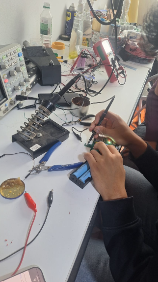
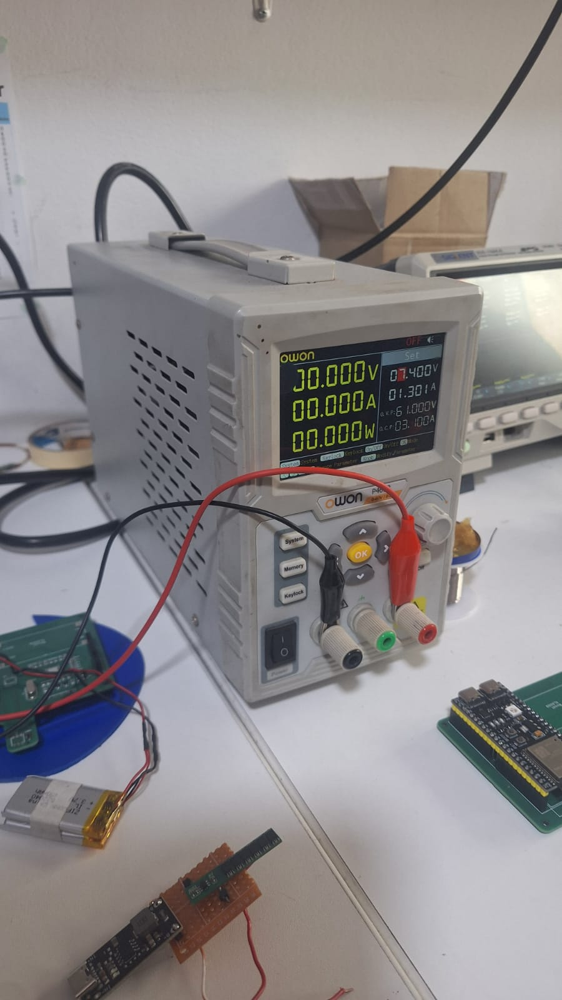
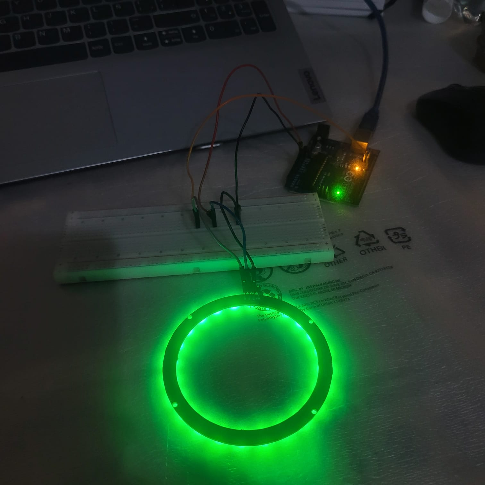
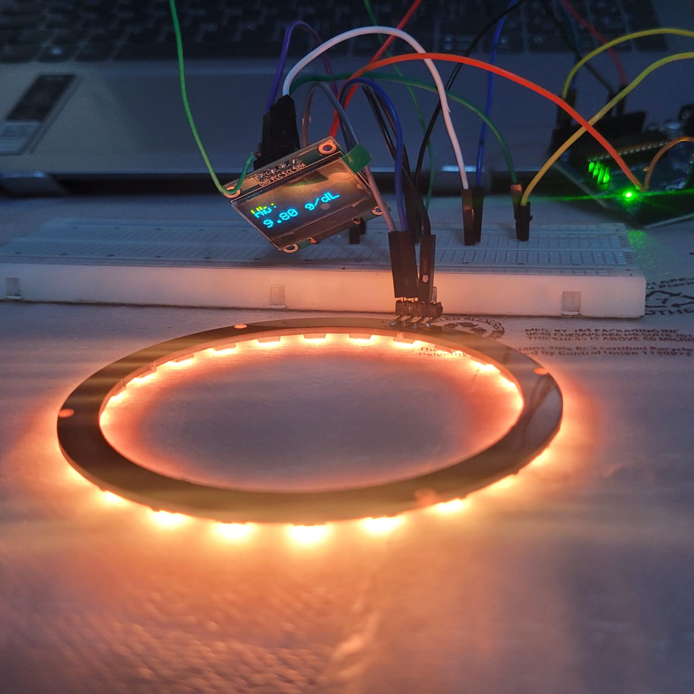
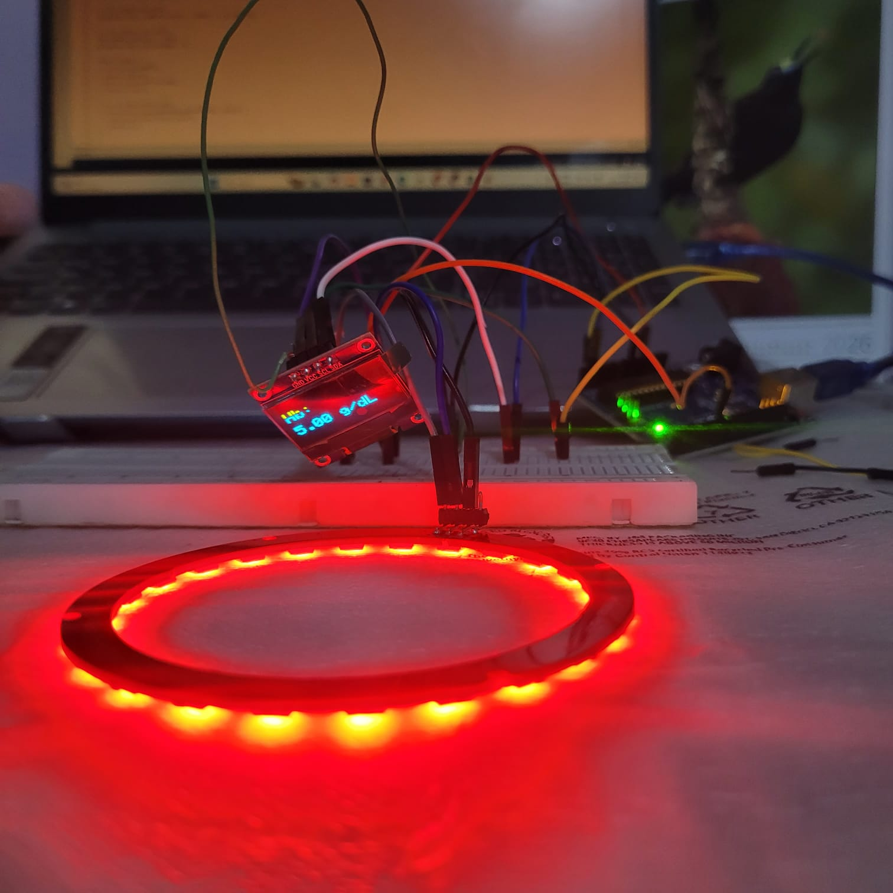
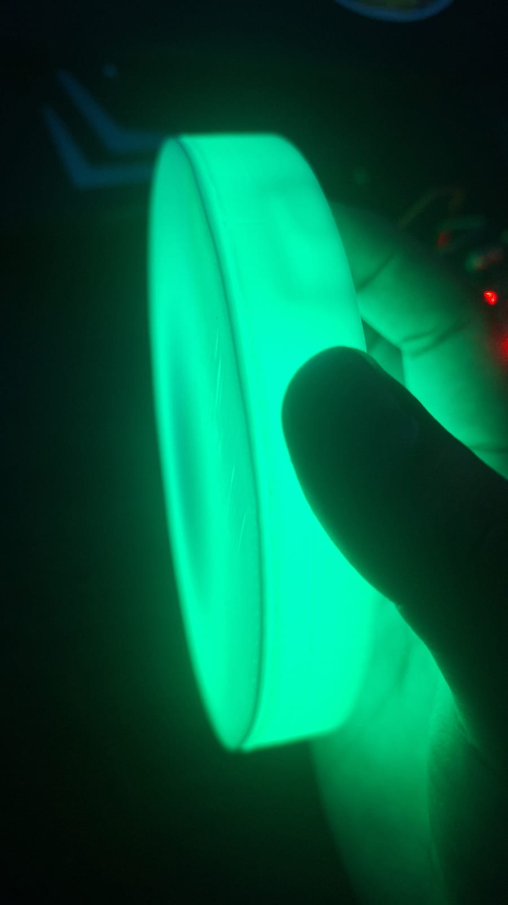

# Hardware

El desarrollo electrónico de HemoKit incluyó pruebas de alimentación, verificación de componentes, integración progresiva y evaluación de los indicadores visuales del prototipo.

Las imágenes publicadas muestran el proceso general de trabajo sin presentar esquemáticos, rutas de la PCB, conexiones detalladas ni parámetros de configuración.

## Desarrollo y pruebas

### Trabajo electrónico

Se realizaron sesiones de ensamblaje, revisión y prueba de los componentes del sistema.

  

### Verificación de la alimentación

Los módulos fueron evaluados con equipos de laboratorio antes de integrarlos en la carcasa.

  

### Indicador visual

Se comprobó el funcionamiento del aro luminoso utilizado para brindar retroalimentación visual al usuario.

  
  
  

### Iluminación de la zona de sensado

También se verificó la difusión de luz y su comportamiento en la zona de interacción con el usuario.

  
  

### Integración en el prototipo

Las pruebas permitieron comprobar el funcionamiento general del sistema antes de continuar con el cierre y acabado de la carcasa.

  

## Confidencialidad

Los esquemáticos, el diseño completo de la PCB, las conexiones, los parámetros electrónicos y los archivos de fabricación se mantienen en la documentación privada del proyecto.
