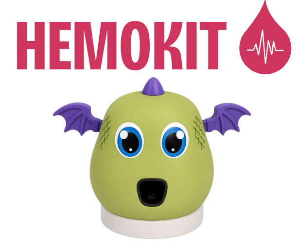

# HemoKit

## Descripción
HemoKit es un dispositivo portátil en desarrollo para apoyar el tamizaje no invasivo de anemia en niños de 2 a 5 años.

El sistema utiliza medición óptica para obtener información relacionada con la hemoglobina y generar una alerta orientativa que facilite la derivación al establecimiento de salud.

> HemoKit es un prototipo académico en desarrollo y no reemplaza
> una prueba clínica ni constituye actualmente un dispositivo
> médico certificado.

  

## Características principales

- Medición no invasiva.
- Diseño portátil y adaptado para niños.
- Funcionamiento sin consumibles por cada medición.
- Registro digital para el seguimiento de resultados.

  

## Documentación

- [Problema y necesidad](01_Problema/)
- [Diseño del sistema](02_Diseno/)
- [Hardware](03_Hardware/)
- [Software](04_Software/)
- [Validación](05_Validacion/)
- [Avances del prototipo](06_Avances/)

## Integrantes

| Integrante | Correo institucional |
|---|---|
| Pamela Vilchez | pamela.vilchez@pucp.edu.pe |
| Elena Mamani | elena.mamani@pucp.edu.pe |
| Pascale Merino | Pascale.merino@pucp.edu.pe |
| Gloria Palma | gloria.palma@pucp.edu.pe |
| Franco Peralta | franco.peralta@pucp.edu.pe |

## Estado del proyecto

**En desarrollo y validación — 2026**

